# Demo TP: About Cars.

## OOP Composition & Inheritance

### Introduction

Oh, hello there. You must be the newbie that just arrived.
My name is William, but you can call me Willy, I am a garagist.

I heard you were looking for a job. Come help me out, I need someone either way.

### Easy

In this first part, let's develop the structure of our project as well as some simple and necessary functions.

#### CarFeature.cs

A simple class representing the features that a car can have.

##### Properties

A feature just has a name and a description :

> - FeatureName, a string with a public get and set
> - FeatureDescription, a string with a public get and set

##### Constructor

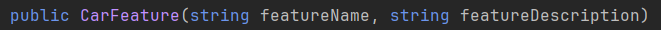

#### Car.cs

Here you need to define the Car abstract class inheriting from the IRaceable interface.

***Prototype***

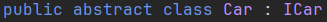

Define all the functions asked by the IRaceable class.

##### Properties

All the cars have a lot of attributes that need to be defined :

> - LicenseNumber, a string with a public get and protected set
> - Brand, a string with a public get and protected set
> - Model, a string with a public get and protected set
> - MaxSpeed, a double with a public get and protected set
> - Acceleration, a double with a public get and protected set
> - Speed, a double with a public get and set
> - Noise, an int with a public get and set
> - Features, a list of CarFeature with a public get

##### AddFeature

A car can have some features, we can also add some of them.

Willy the garagist wants to add new personalized features to this car.
That's the point of this function.

***Prototype***

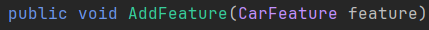

***Code Examples***

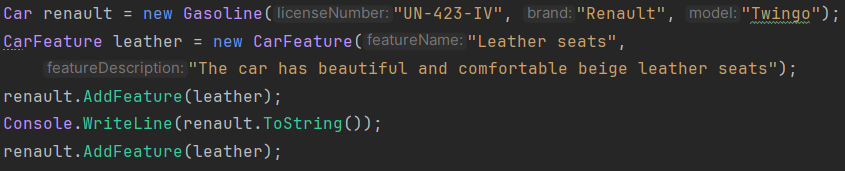

***Output***

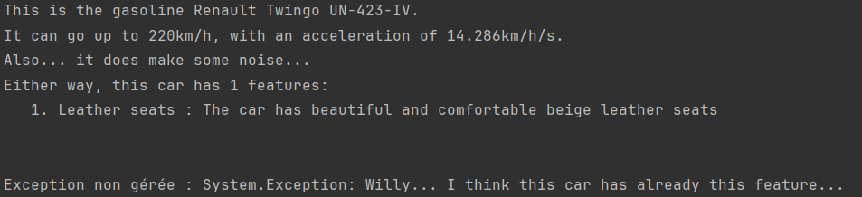

*Remarks :*

Do not worry about the testing, it will be possible after doing the ToString function.

##### RemoveFeature

The car is too heavy because of all of those features.

Willy the garagist wants to remove a feature from this car.
Make a function to be able to remove one feature.

***Prototype***

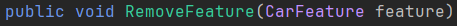

***Code Examples***

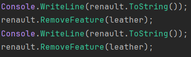

***Output***

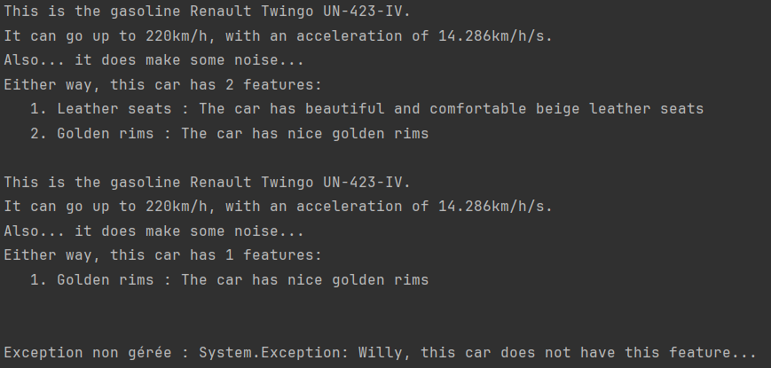

*Remarks :*

Do not worry about the testing, it will be possible after doing the ToString function.

#### Gasoline.cs

The class representing a gasoline car. Child of Car class.

##### Constructor

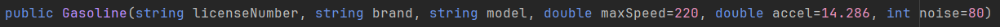

##### ToString

***Prototype***

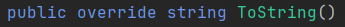

***Code Example***

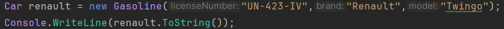

***Output***

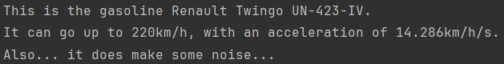

*Remarks :*

A car having more than or equal to 50 is considered noisy.
Also, if the car has features, you must show them (cf. AddFeature / RemoveFeature)

#### Electrical.cs

The class representing an electrical car. Child of Car class.

##### Constructor

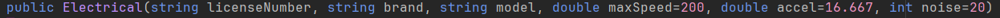

##### ToString

***Prototype***

***Code Example***

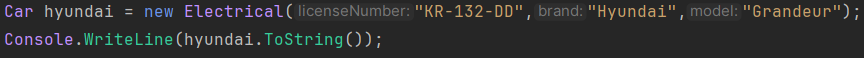

***Output***

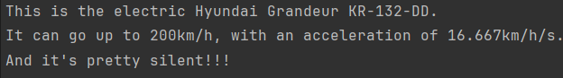

*Remarks :*

A car having more than or equal to 50 is considered noisy.
Also, if the car has features, you must show them (cf. AddFeature / RemoveFeature)

#### Garage.cs

The class representing a garage, could be Willy's.
Inherits of the interface IGarage.

You should also define and initialize Cars, which is a public list of Car, the cars inside the garage.
 As well as CurrentOrdering, a private Order initialized to None.

Don't forget to define the ToString function.

***Prototype***

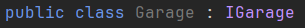

### Intermediate

#### Garage.cs

##### ToString

Simply a function to print out the cars in the Garage.

***Prototype***

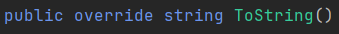

***Code Example***

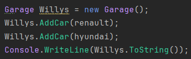

***Output***

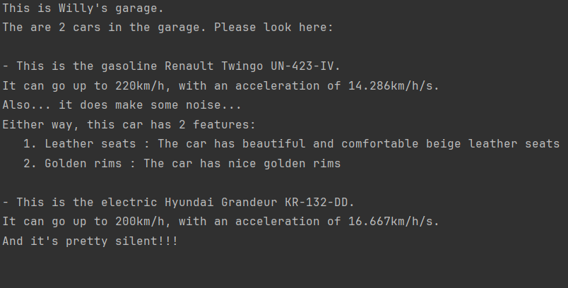

*Remarks :*

Use the Car ToString in this function.

##### AddCar

Willy the garagist just received a new car, and he wants to put it in his garage, but at the right place.

***Prototype***

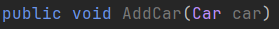

***Code Example***

***Output***

*Remarks :*

> Use CurrentOrdering to know where to insert the new car. 
> If CurrentOrdering is None, simply add it at the end of the list. 
>- When ordered by brand and model, it goes from "A" to "Z"
>- When ordered by speed, it is from fastest to lowest
>- When ordered by noise, it is from most silent to noisiest

>Do auxiliary functions to help you. 
>**Attention:** We will evaluate the speed of the program.

##### RemoveCar

Willy the garagist is selling a car, go take it out of the garage.

***Prototype***

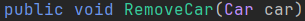

***Code Example***

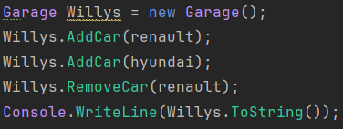

***Output***

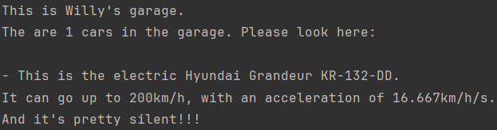

##### Arrange

Willy the garagist wants to be able to arrange his garage's cars.

Sometimes he wants them to be ordered by brand and model name,
sometimes by maximum speed or even by noisiness.

Help him out to befriend him.

***Prototype***

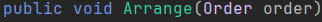

***Code Examples***

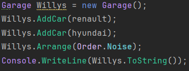

***Output***

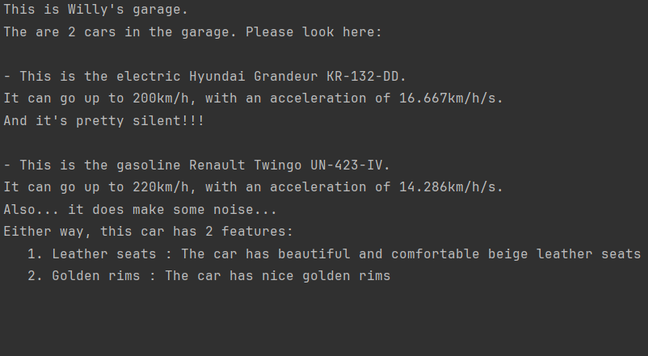

*Remarks :*

>- When ordering by brand and model, it should go from "A" to "Z"
>- When ordering by speed, make it from fastest to lowest
>- When ordering by noise, make it from most silent to noisiest
>- Don't forget to update CurrentOrdering 
>
>You can do auxiliary functions to help you out.

### Hard

#### Car.cs

##### TimeToFinish

Willy the garagist would like to estimate the time that this car would take to finish this track.

***Prototype***

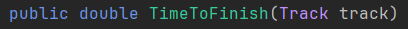

***Code Example***

***Output***

*Remarks :*

>- For this algorithm, we suppose that when a car is turning, it goes at 120km/h. After a turn, the car gradually comes back at its maximum speed.
>- You're supposed to overestimate the time that the car would do (if it takes 19.2 seconds, make it 20).

#### Garage.cs

##### FindBestCar

Willy the garagist now trusts you (if you did the previous functions well that is).
 However, there will soon be an important race that he wants to win for sure.
 All he knows is the length of the race and the number of non-negligible turns inside it.
 He asks you to find the best car you can for this race.
 If you do not mess this one up, you might be able to participate in some races with his cars.

***Prototype***

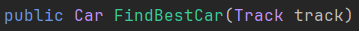

***Code Example***

***Output***

